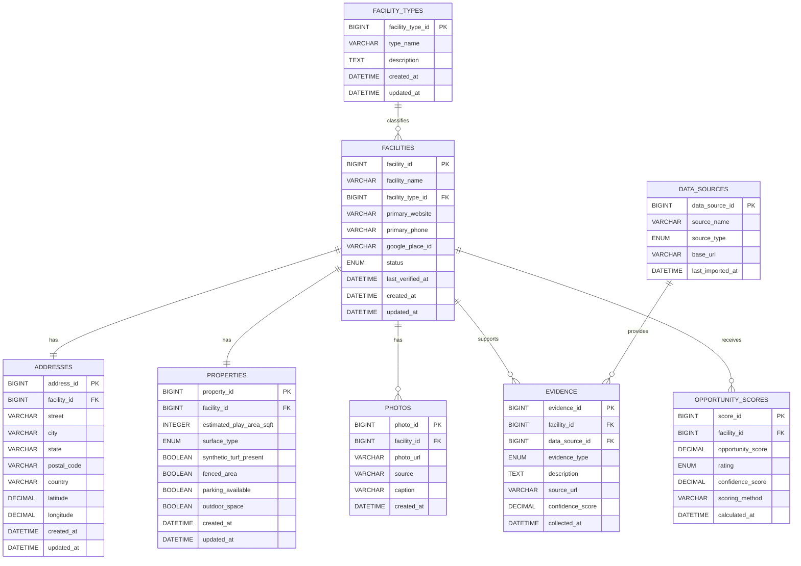

# Entity Relationship Diagram (ERD)

Version: 1.1

## 1. Purpose

An **Entity Relationship Diagram (ERD)** is a picture of the database tables and their connections.

This diagram matches `05-database-schema.md`, which is the main file to trust for exact database details.

The diagram only shows the first database version. Vendors, Saved Leads, Social Profiles, and Contacts will be designed later.

To keep the diagram readable, it shortens the ID type to `BIGINT`:

- a `BIGINT` marked `PK` is a `BIGINT UNSIGNED AUTO_INCREMENT` primary key
- a `BIGINT` marked `FK` is a `BIGINT UNSIGNED` foreign key

`PK` means primary key: the unique ID for a record. `FK` means foreign key: an ID that connects to another table.

## 2. Core Entity

`facilities` is the main table. One Facility record represents one physical business location.

A Facility:

- belongs to one Facility Type
- has one Address
- has one Property record
- may have many Photos
- may have many Evidence records
- may have many Opportunity Scores over time

Each Evidence record points to one Data Source. Many Evidence records can use the same Data Source.

## 3. Relationship Details

### Facility Types → Facilities

Many Facilities can use the same Facility Type. Each Facility uses one Facility Type.

**Relationship:** One Facility Type to many Facilities (1:M)

---

### Facilities → Addresses

Each Facility has one Address, and each Address belongs to one Facility.

**Relationship:** One Facility to one Address (1:1)

---

### Facilities → Properties

Each Facility has one Property record, and each Property record belongs to one Facility.

**Relationship:** One Facility to one Property (1:1)

---

### Facilities → Photos

A Facility may have zero or many Photos. Each Photo belongs to one Facility.

**Relationship:** One Facility to many Photos (1:M)

---

### Facilities → Evidence

A Facility may have zero or many Evidence records. Each Evidence record belongs to one Facility.

**Relationship:** One Facility to many Evidence records (1:M)

---

### Data Sources → Evidence

Many Evidence records can point to the same Data Source. Each Evidence record points to one Data Source.

**Relationship:** One Data Source to many Evidence records (1:M)

---

### Facilities → Opportunity Scores

A Facility may receive many Opportunity Scores over time. Each Opportunity Score belongs to one Facility.

**Relationship:** One Facility to many Opportunity Scores (1:M)

The current score is the record with the most recent `calculated_at` value.

## 4. Entity Relationship Diagram

## 5. What the Diagram Shows

- Facilities are the main records in the first database version.
- Facility Types are stored once so category names stay consistent.
- Addresses contain geographic coordinates.
- Properties contain searchable facts about each physical site.
- Evidence explains research findings and points to their Data Sources.
- Evidence may store the exact supporting page or item in `source_url`.
- Opportunity Scores are separate records so older scores can be kept.
- MySQL creates the internal primary keys. Foreign keys store matching IDs to connect records.
- Vendors, Saved Leads, Social Profiles, and Contacts are planned for later.
