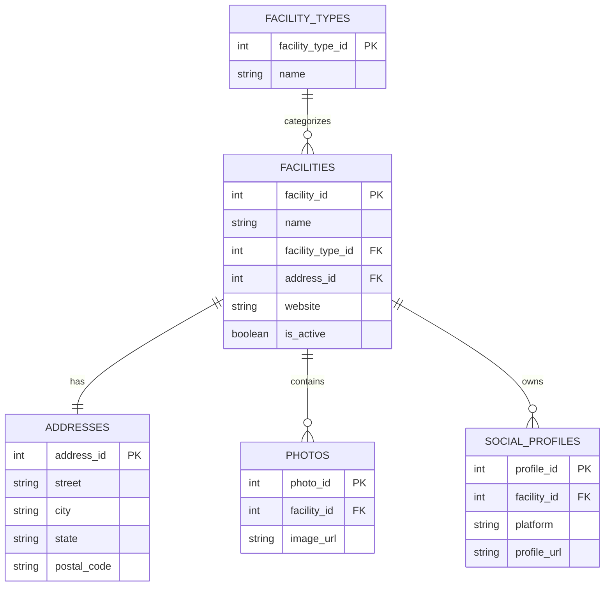

# Entity Relationship Diagram (ERD)

## 1. Purpose

The Entity Relationship Diagram (ERD) illustrates how the Turf Facility Finder database is organized.

Rather than storing all information in one large table, the application separates data into logical entities that reduce duplication, improve maintainability, and support future expansion.

Each relationship represents a real-world connection between facilities and the information collected about them, including addresses, evidence, media, opportunity scores, and vendor interactions.

## 2. Core Entity

The Facilities table acts as the central entity within the application.

Nearly every other table exists to describe some aspect of a facility.

A facility can:

- belong to one Facility Type
- have one Address
- have many Photos
- have many Social Profiles
- have many Evidence records
- receive multiple Opportunity Scores
- be referenced by multiple Data Sources
- be saved by multiple Vendors

Because Facilities represents the primary business object of the application, nearly every table references its Facility ID.

## 3. Relationship Types

The database uses three primary relationship types.

### One-to-One (1:1)

One record in one table corresponds to one record in another table.

Example:

A Facility has one Address.

---

### One-to-Many (1:M)

One record in one table may have many related records.

Example:

A Facility may contain many Photos.

---

### Many-to-Many (M:M)

Many records in one table can relate to many records in another.

Example:

Multiple Vendors can save the same Facility, and each Vendor can save many Facilities.

This relationship is handled through a junction table named Saved_Leads.

## 4. Relationship Details

### Facility Types → Facilities

One Facility Type can classify many Facilities.

Relationship:

**Cardinality:** One-to-Many (1:M)

---

### Facilities → Addresses

Each Facility has one physical address.

Relationship:

Facilities (1) → (1) Addresses

---

### Facilities → Social Profiles

Each Facility may have multiple social media accounts.

Relationship:

**Cardinality:** One-to-Many (1:M) Social Profiles

---

### Facilities → Photos

Each Facility may contain multiple photographs.

Relationship:

**Cardinality:** One-to-Many (1:M) Photos

---

### Facilities → Evidence

Each Facility may contain multiple pieces of supporting evidence gathered during research.

Relationship:

**Cardinality:** One-to-Many (1:M) Evidence

---

### Data Sources → Evidence

One data source may contribute evidence for many facilities.

Relationship:

**Cardinality:** One-to-Many (1:M) Evidence

---

### Facilities → Opportunity Scores

A Facility may receive multiple opportunity scores over time as new information becomes available.

Relationship:

**Cardinality:** One-to-Many (1:M) Opportunity Scores

---

### Vendors → Saved Leads

A Vendor may save many Facilities.

Relationship:
**Cardinality:** One-to-Many (1:M) Saved Leads

---

### Facilities → Saved Leads

A Facility may be saved by many Vendors.

Relationship:
**Cardinality:** One-to-Many (1:M) Saved Leads

## 5. Entity Relationship Diagram

## 6. Design Decisions

The Turf Facility Finder database follows a normalized relational design to reduce redundancy, improve data consistency, and support future growth.

Key design decisions include:

- Facilities serve as the central entity within the application.
- Supporting information is separated into specialized tables instead of duplicating data.
- Opportunity Scores are stored independently to preserve historical scoring as facilities change over time.
- Evidence is stored separately to allow multiple observations from different research sources.
- Saved Leads functions as a junction table supporting a many-to-many relationship between Vendors and Facilities.
- Facilities are never permanently deleted. Closed businesses are marked inactive to preserve historical records and previous research.